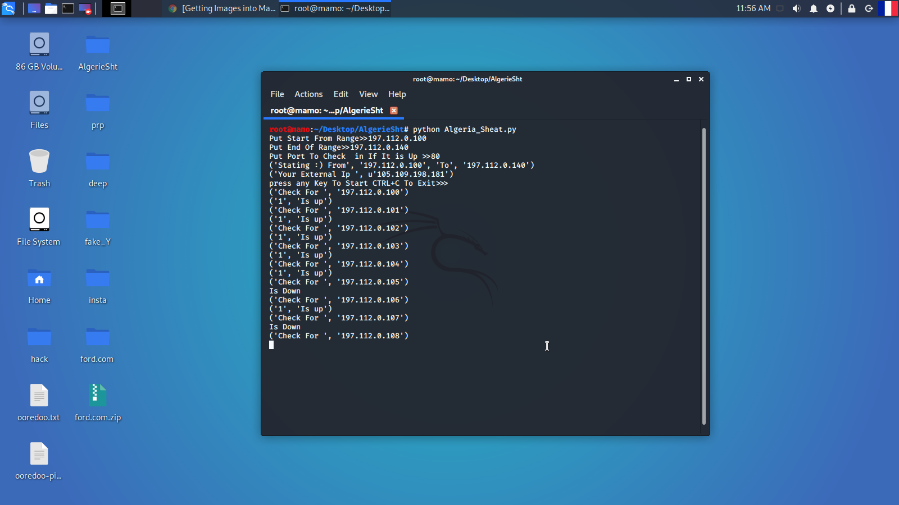
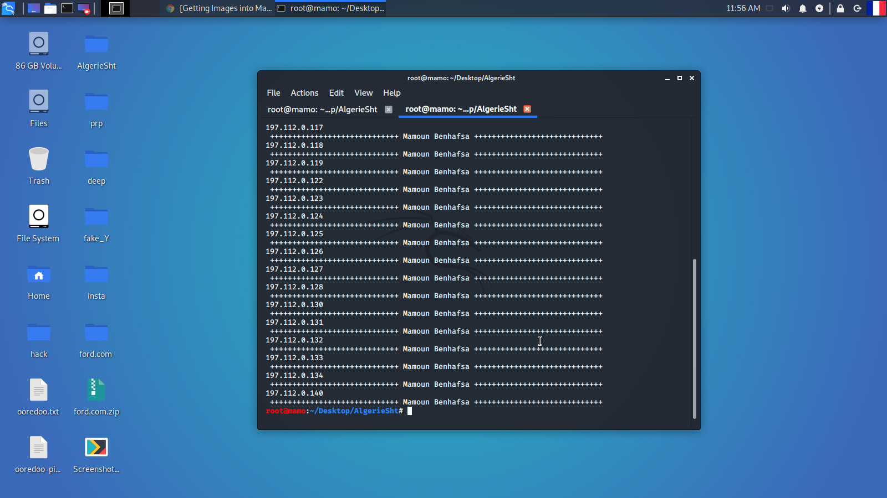

Range IP Check With A Define Port From User
===========================================
Example : Scan **192.168.1.0** To **192.168.255.255** Is There *Port* **80** Open In This Range The Script Will Make A File Called **Rezult.txt** With In Hosts That **80** Port Is Up 

